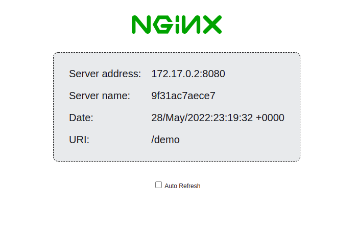

# kubeedge-app
Rerpository for kubeedge applications

## nginx-app

Simple nginx-app that shows information about the execution context. Can be executed without root privileges (port>1024)

How to build
```
$ docker build . -t nginx-app
```

How to run:
```
$ docker run -P -d nginx-app
```

http://localhost:8080/demo


